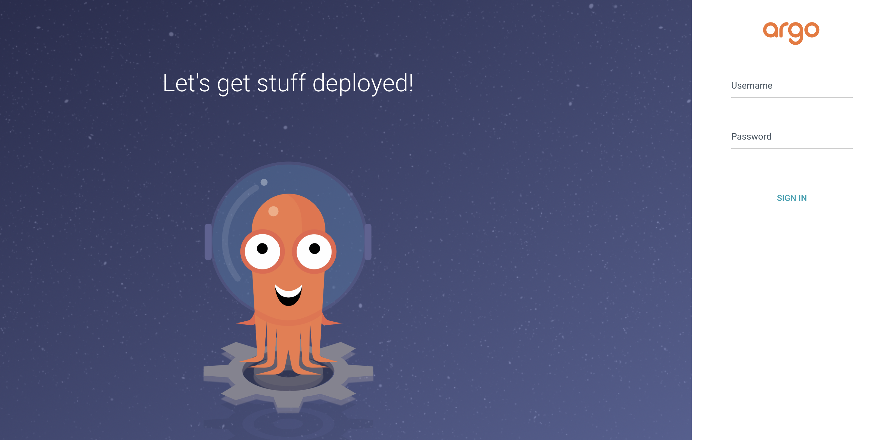
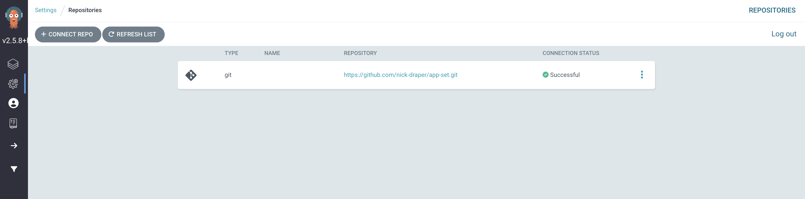
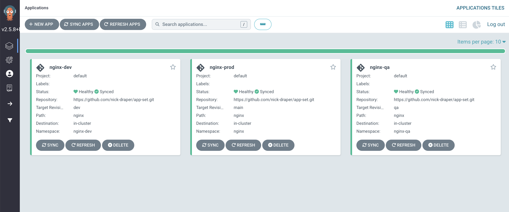
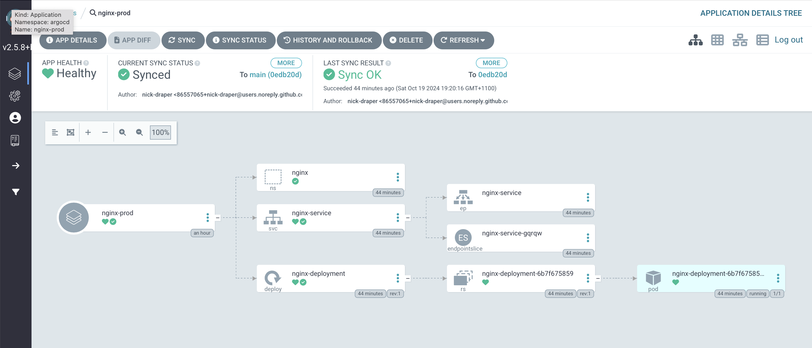

# ArgoCD Application Set

This is a simple nginx application to demonstarte working with argocd.

## Install ArgoCD

```sh
➜  ~ minikube profile list
|----------|-----------|---------|--------------|------|---------|---------|-------|--------|
| Profile  | VM Driver | Runtime |      IP      | Port | Version | Status  | Nodes | Active |
|----------|-----------|---------|--------------|------|---------|---------|-------|--------|
| minikube | podman    | crio    | 192.168.49.2 | 8443 | v1.26.1 | Running |     1 | *      |
|----------|-----------|---------|--------------|------|---------|---------|-------|--------|
➜  ~ kubectl create ns argocd
namespace/argocd created
➜  ~ kubectl apply -n argocd -f https://raw.githubusercontent.com/argoproj/argo-cd/v2.5.8/manifests/install.yaml
customresourcedefinition.apiextensions.k8s.io/applications.argoproj.io created
customresourcedefinition.apiextensions.k8s.io/applicationsets.argoproj.io created
customresourcedefinition.apiextensions.k8s.io/appprojects.argoproj.io created
serviceaccount/argocd-application-controller created
serviceaccount/argocd-applicationset-controller created
serviceaccount/argocd-dex-server created
serviceaccount/argocd-notifications-controller created
serviceaccount/argocd-redis created
serviceaccount/argocd-repo-server created
serviceaccount/argocd-server created
role.rbac.authorization.k8s.io/argocd-application-controller created
role.rbac.authorization.k8s.io/argocd-applicationset-controller created
role.rbac.authorization.k8s.io/argocd-dex-server created
role.rbac.authorization.k8s.io/argocd-notifications-controller created
role.rbac.authorization.k8s.io/argocd-server created
clusterrole.rbac.authorization.k8s.io/argocd-application-controller created
clusterrole.rbac.authorization.k8s.io/argocd-server created
rolebinding.rbac.authorization.k8s.io/argocd-application-controller created
rolebinding.rbac.authorization.k8s.io/argocd-applicationset-controller created
rolebinding.rbac.authorization.k8s.io/argocd-dex-server created
rolebinding.rbac.authorization.k8s.io/argocd-notifications-controller created
rolebinding.rbac.authorization.k8s.io/argocd-redis created
rolebinding.rbac.authorization.k8s.io/argocd-server created
clusterrolebinding.rbac.authorization.k8s.io/argocd-application-controller created
clusterrolebinding.rbac.authorization.k8s.io/argocd-server created
configmap/argocd-cm created
configmap/argocd-cmd-params-cm created
configmap/argocd-gpg-keys-cm created
configmap/argocd-notifications-cm created
configmap/argocd-rbac-cm created
configmap/argocd-ssh-known-hosts-cm created
configmap/argocd-tls-certs-cm created
secret/argocd-notifications-secret created
secret/argocd-secret created
service/argocd-applicationset-controller created
service/argocd-dex-server created
service/argocd-metrics created
service/argocd-notifications-controller-metrics created
service/argocd-redis created
service/argocd-repo-server created
service/argocd-server created
service/argocd-server-metrics created
deployment.apps/argocd-applicationset-controller created
deployment.apps/argocd-dex-server created
deployment.apps/argocd-notifications-controller created
deployment.apps/argocd-redis created
deployment.apps/argocd-repo-server created
deployment.apps/argocd-server created
statefulset.apps/argocd-application-controller created
networkpolicy.networking.k8s.io/argocd-application-controller-network-policy created
networkpolicy.networking.k8s.io/argocd-applicationset-controller-network-policy created
networkpolicy.networking.k8s.io/argocd-dex-server-network-policy created
networkpolicy.networking.k8s.io/argocd-notifications-controller-network-policy created
networkpolicy.networking.k8s.io/argocd-redis-network-policy created
networkpolicy.networking.k8s.io/argocd-repo-server-network-policy created
networkpolicy.networking.k8s.io/argocd-server-network-policy created

## wait for creation

➜  ~ kubectl get all -n argocd        
NAME                                                   READY   STATUS    RESTARTS   AGE
pod/argocd-application-controller-0                    1/1     Running   0          118s
pod/argocd-applicationset-controller-fdd95f5f7-pdtgl   1/1     Running   0          118s
pod/argocd-dex-server-86d49bbbf4-jbf8p                 1/1     Running   0          118s
pod/argocd-notifications-controller-7ddbb8469b-fpl6b   1/1     Running   0          118s
pod/argocd-redis-7b59bffbff-vmwn7                      1/1     Running   0          118s
pod/argocd-repo-server-f86457789-lbh5d                 1/1     Running   0          118s
pod/argocd-server-657f4898fc-7gq4n                     1/1     Running   0          118s

NAME                                              TYPE        CLUSTER-IP       EXTERNAL-IP   PORT(S)                      AGE
service/argocd-applicationset-controller          ClusterIP   10.107.149.118   <none>        7000/TCP,8080/TCP            118s
service/argocd-dex-server                         ClusterIP   10.107.123.248   <none>        5556/TCP,5557/TCP,5558/TCP   118s
service/argocd-metrics                            ClusterIP   10.109.49.244    <none>        8082/TCP                     118s
service/argocd-notifications-controller-metrics   ClusterIP   10.101.49.146    <none>        9001/TCP                     118s
service/argocd-redis                              ClusterIP   10.102.109.109   <none>        6379/TCP                     118s
service/argocd-repo-server                        ClusterIP   10.106.47.167    <none>        8081/TCP,8084/TCP            118s
service/argocd-server                             ClusterIP   10.100.53.34     <none>        80/TCP,443/TCP               118s
service/argocd-server-metrics                     ClusterIP   10.110.41.100    <none>        8083/TCP                     118s

NAME                                               READY   UP-TO-DATE   AVAILABLE   AGE
deployment.apps/argocd-applicationset-controller   1/1     1            1           118s
deployment.apps/argocd-dex-server                  1/1     1            1           118s
deployment.apps/argocd-notifications-controller    1/1     1            1           118s
deployment.apps/argocd-redis                       1/1     1            1           118s
deployment.apps/argocd-repo-server                 1/1     1            1           118s
deployment.apps/argocd-server                      1/1     1            1           118s

NAME                                                         DESIRED   CURRENT   READY   AGE
replicaset.apps/argocd-applicationset-controller-fdd95f5f7   1         1         1       118s
replicaset.apps/argocd-dex-server-86d49bbbf4                 1         1         1       118s
replicaset.apps/argocd-notifications-controller-7ddbb8469b   1         1         1       118s
replicaset.apps/argocd-redis-7b59bffbff                      1         1         1       118s
replicaset.apps/argocd-repo-server-f86457789                 1         1         1       118s
replicaset.apps/argocd-server-657f4898fc                     1         1         1       118s

NAME                                             READY   AGE
statefulset.apps/argocd-application-controller   1/1     118s
```


## ArgoCD

Login to argoCD and manually sync the apps

```sh
➜  ~ kubectl -n argocd get secret argocd-initial-admin-secret -o jsonpath="{.data.password}" | base64 -d; echo
XXXXXXXXXXXX


➜  ~ kubectl port-forward svc/argocd-server -n argocd 8080:443
Forwarding from 127.0.0.1:8080 -> 8080
Forwarding from [::1]:8080 -> 8080
Handling connection for 8080
....
```
### Login using 'admin' and retrieved password



### Create repo connection

Type: HTTPS
Project: default
Repository URL: https://github.com/nick-draper/app-set.git



### Create ArcoCD applicationset yaml

```yaml
apiVersion: argoproj.io/v1alpha1
kind: ApplicationSet
metadata:
  name: nginx-application-set
  namespace: argocd
spec:
  goTemplate: true
  generators:
  - list:
      elements:
      - env: dev
      - env: qa
      - env: prod
  template:
    metadata:
      name: 'nginx-{{.env}}'
    spec:
      project: default
      source:
        repoURL: https://github.com/nick-draper/app-set.git
        targetRevision: '{{ if eq .env "prod" }}main{{ else }}{{.env}}{{ end }}'
        path: nginx
      destination:
        server: https://kubernetes.default.svc
        namespace: '{{ if eq .env "prod" }}nginx{{ else }}nginx-{{.env}}{{ end }}'

 ➜  minikube kubectl apply -f app-set.yaml
applicationset.argoproj.io/nginx-application-set created
```

### Manual sync





